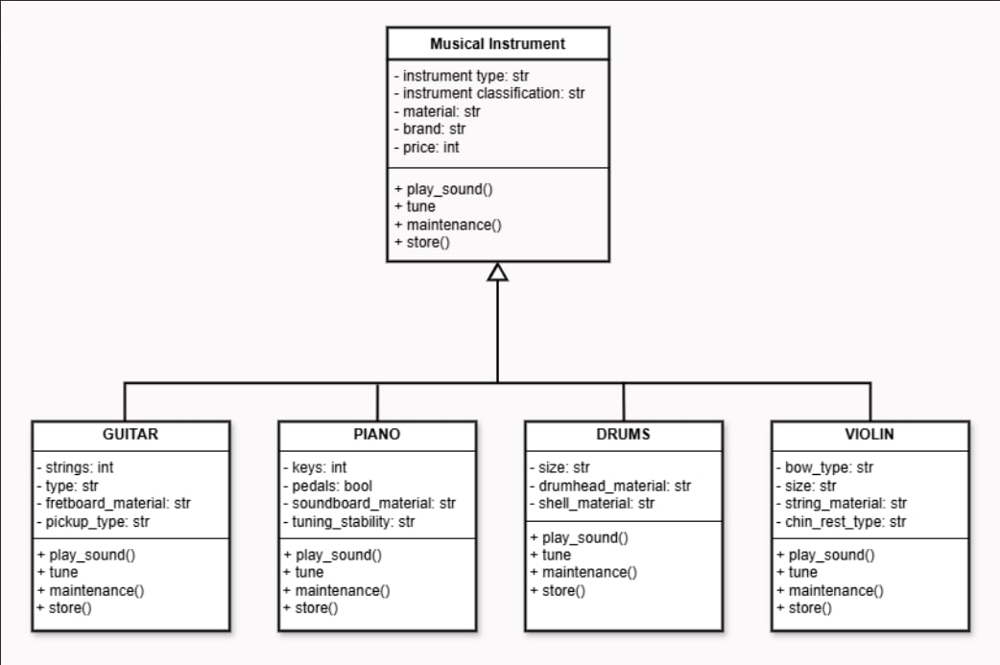

# CS 1204 - CS 121: Advanced Object-Oriented Programming  
## Group Project: Musical Instruments Simulation 🎵

## Submitted by:

| Name | GitHub |
|------|--------|
| Cueto, Carl John T. | *[Cjaizee](https://github.com/Cjaizee)* |
| De Castro, John Christian N. | *[Aiahtots](https://github.com/Aiahtots)* |
| Fernandez, John Rommel P. | *[Nicojin](https://github.com/Nicojin)* |
| Gonzaga, Chloe Yzabelle M. | *[chlyzbll](https://github.com/chlyzbll)* |

---

## 📝 Project Description

This program demonstrates **Object-Oriented Programming (OOP)** principles in Python:
- **Abstraction**
- **Inheritance**
- **Encapsulation**
- **Polymorphism**

It simulates various musical instruments and uses the `pygame` library to play actual sounds.

---

## 🎸 Supported Instruments
- 🎸 Guitar
- 🎹 Piano
- 🥁 Drums
- 🎻 Violin

Each instrument can:
- 🔊 Play sound (based on tuning state)
- 🎼 Be tuned
- 🛠️ Show maintenance instructions
- 📦 Be stored

---

## 🔧 How to Use

1. **Install dependencies** (only needs to be done once):

   ```bash
   pip install pygame
   ```

2. **Run the program**:

   ```bash
   python main.py
   ```

3. **Follow the main menu options**:

   ```
   1. Guitar (Brand)
   2. Piano (Brand)
   3. Drums (Brand)
   4. Violin (Brand)
   0. Exit
   ```

4. **After selecting an instrument, you'll see this submenu**:

   ```
   1. Play Sound
   2. Tune
   3. Maintenance Info
   4. Store (Back to Menu)
   ```

5. **Audio Notes**:
   - Tuned instruments will play a **pleasant** sound.
   - Untuned instruments will play an **unpleasant** or "ugly" sound.
   - Make sure audio files are correctly placed inside the `audio/` folder.

6. **Exiting**:
   - Select `0` from the main menu to exit the program.
   - After storing an instrument, you'll return to the main menu automatically.

---

## 🧠 Code Snippets

### ✅ Abstract Class Implementation
```python
from abc import ABC, abstractmethod

class MusicalInstrument(ABC):
    def __init__(self, instrument_type, instrument_classification, material, brand, price):
        self.instrument_type = instrument_type
        self.instrument_classification = instrument_classification
        self.material = material
        self.brand = brand
        self.price = price
        self.is_tuned = False

    @abstractmethod
    def play_sound(self): pass

    @abstractmethod
    def tune(self): pass

    @abstractmethod
    def maintenance(self): pass

    @abstractmethod
    def store(self): pass
```

### 🎸 Guitar Class with Inheritance and Overriding
```python
class Guitar(MusicalInstrument):
    def __init__(self, material, brand, price, strings, type, fretboard_material, pickup_type):
        super().__init__('Guitar', 'String', material, brand, price)
        self.strings = strings
        self.type = type
        self.fretboard_material = fretboard_material
        self.pickup_type = pickup_type

    def play_sound(self):
        if self.is_tuned:
            play_audio("audio/guitar_tuned.wav")
        else:
            play_audio("audio/guitar_untuned.mp4")

    def tune(self):
        self.is_tuned = True

    def maintenance(self):
        print("Change strings regularly and clean fretboard.")

    def store(self):
        print("Store in a hard case to avoid warping.")
```

### 🔊 Play Audio Function Using pygame
```python
import pygame

pygame.init()

def play_audio(file):
    pygame.mixer.music.load(file)
    pygame.mixer.music.play()
    while pygame.mixer.music.get_busy():
        pygame.time.Clock().tick(10)
```

---

## 📁 File Structure

```
project/
│
├── audio/
│   ├── guitar_tuned.wav
│   ├── guitar_untuned.mp4
│   ├── piano_tuned.wav
│   └── ...
├── main.py
└── README.md
```

---

## ⚠️ Notes

- Make sure all `.wav` and `.mp3` audio files are in the `audio/` folder.
- Instruments will sound **pleasant when tuned**, and **ugly when untuned**.
- You can add more instruments by inheriting from `MusicalInstrument`.

---

> “Music gives a soul to the universe, wings to the mind, flight to the imagination, and life to everything.” – Plato


---

## 📌 Key Code Components & Descriptions

### 🎼 Class Definitions

#### 1. `MusicalInstrument` (Abstract Base Class)
Defines the structure all instruments must follow.

```python
from abc import ABC, abstractmethod

class MusicalInstrument(ABC):
    ...
```
**Purpose:** Enforces that all instruments implement methods like `play_sound()`, `tune()`, `maintenance()`, and `store()`.

---

#### 2. `Guitar`, `Piano`, `Drums`, `Violin` (Concrete Classes)
These inherit from `MusicalInstrument` and define unique properties and behaviors.

Example:  
```python
class Piano(MusicalInstrument):
    def play_sound(self):
        if self.is_tuned:
            play_audio("audio/piano_tuned.wav")
        else:
            play_audio("audio/piano_untuned.wav")
```

**Purpose:** Customizes behavior and attributes based on the instrument type.

---

### 🎧 Audio Playback with `pygame`

```python
def play_audio(file):
    pygame.mixer.music.load(file)
    pygame.mixer.music.play()
    while pygame.mixer.music.get_busy():
        pygame.time.Clock().tick(10)
```

**Purpose:** Plays sound files depending on instrument and tuning state.

---

### 🧭 Menus for User Interaction

```python
def main_menu():
    ...
```

**Purpose:** Lets the user choose instruments and perform actions in a loop until exit.

```python
def instrument_menu(instrument):
    ...
```

**Purpose:** Handles instrument-specific actions like playing, tuning, maintaining, and storing.

---

## 🧱 Class Diagram




---